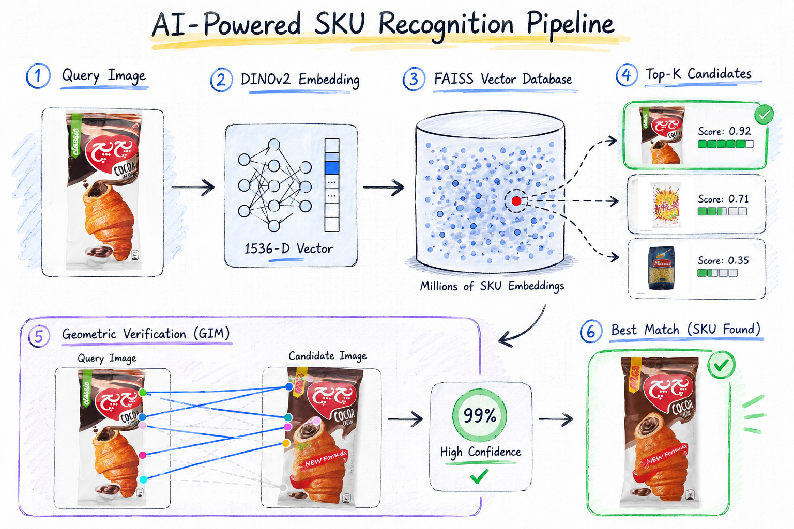
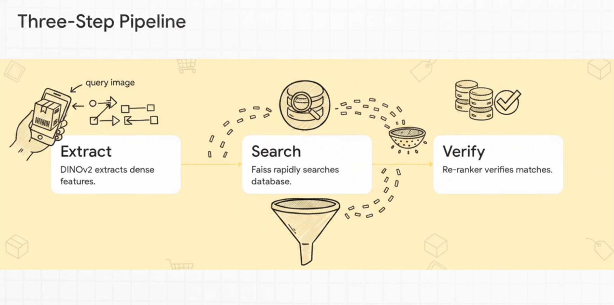

# Visual Product Recognition


<p align="center">
  
</p>

A high-performance **Visual Product (SKU) Recognition** system for identifying products from images using a **coarse-to-fine visual retrieval pipeline**.
The system combines **DINOv2** for semantic image embeddings, **FAISS** for efficient nearest-neighbor search, and **GIM (Geometric Image Matching)** for geometric verification, providing robust product identification even when visually similar products exist.

---

## Features

- DINOv2 image embeddings
- FAISS approximate nearest neighbor search
- GIM geometric verification
- Two-stage retrieval architecture
- Modular design
- Microservice-based matcher
- Easy to extend with OCR or reranking

---

## Architecture

```
                    Query Image
                         │
                         ▼
                  DINOv2 Encoder
                         │
                         ▼
                 Feature Embedding
                         │
                         ▼
                     FAISS Index
                         │
                  Top-K Candidates
                         │
                         ▼
               GIM Verification Service
                         │
                         ▼
                  Best Matching SKU
```

---

## Pipeline

<p align="center">
  
</p>

### 1. Feature Extraction

Images are encoded into high-dimensional feature vectors using **DINOv2**.

```
Image
   │
   ▼
DINOv2
   │
   ▼
Embedding
```

---

### 2. Candidate Retrieval

Embeddings are indexed with **FAISS**, enabling fast similarity search over large image collections.

```
Embedding
   │
   ▼
FAISS
   │
   ▼
Top-K Candidates
```

---

### 3. Geometric Verification

The retrieved candidates are verified using **GIM**, which performs geometric feature matching to eliminate visually similar but incorrect products.

```
Top-K
   │
   ▼
GIM
   │
   ▼
Best Match
```

---

## Installation

Clone the repository

```bash
git clone https://github.com/kouroshkarimi/visual_product_recognition.git

cd visual_product_recognition
```

Setup the environments

```bash
bash setup.sh
```
This install dependencies and two conda environments

---
## Build the Gallery database

Generate database for all gallery images for all skus.

```bash
conda activate loma
python scripts/create_database.py
```

This creates

```
gallery.db
```

---

## Build the Gallery Embedding vectors

Generate embeddings for all gallery images.

```bash
python scripts/build_embeddings.py
```

This creates

```
embedding.npy
ids.npy
paths.npyy
```

---

## Build the Gallery Index

Generate embeddings for all gallery images.

```bash
python scripts/build_index.py
```

This creates

```
gallery.index
```

---

## Run the Matcher Service

Start the GIM microservice.

```bash
uvicorn matcher_server:app --host 0.0.0.0 --port 8000
```

Health check

```
GET /health
```

---

## Inference

Run image retrieval in the another conda env.

```bash
conda activate cangen
python scripts/inference.py
```

The pipeline performs:

1. Encode the query image.
2. Retrieve Top-K candidates using FAISS.
3. Send candidates to the GIM microservice.
4. Return the best matching SKU.

---

## Example Output

```
Top-5 Candidates

1
Score : 0.91
Image : gallery/sku_011.jpg

2
Score : 0.88
Image : gallery/sku_012.jpg

3
Score : 0.84
Image : gallery/sku_019.jpg
```

After GIM verification

```
Best Match

SKU : sku_011
Score : 0.97
Inliers : 143
```

---

## Technologies

- Python
- PyTorch
- DINOv2
- FAISS
- FastAPI
- OpenCV
- NumPy
- Pillow

---

## Why Two-Stage Retrieval?

Searching every image with local feature matching is computationally expensive.

Instead, the system first retrieves a small set of semantically similar candidates using DINOv2 and FAISS, then applies geometric verification only to those candidates.

This approach provides:

- Fast retrieval
- High scalability
- Improved robustness for visually similar products
- Better accuracy than embedding-only retrieval

---

## Future Improvements

- OCR-based verification
- Brand recognition
- Learned reranking model
- Product metadata fusion
- ONNX/TensorRT optimization
- NVIDIA Jetson deployment
- Multimodal retrieval
- Incremental index updates

---

## License

MIT License

---

## Acknowledgments

This project builds upon the following open-source technologies:

- DINOv2
- FAISS
- GIM
- PyTorch
- FastAPI